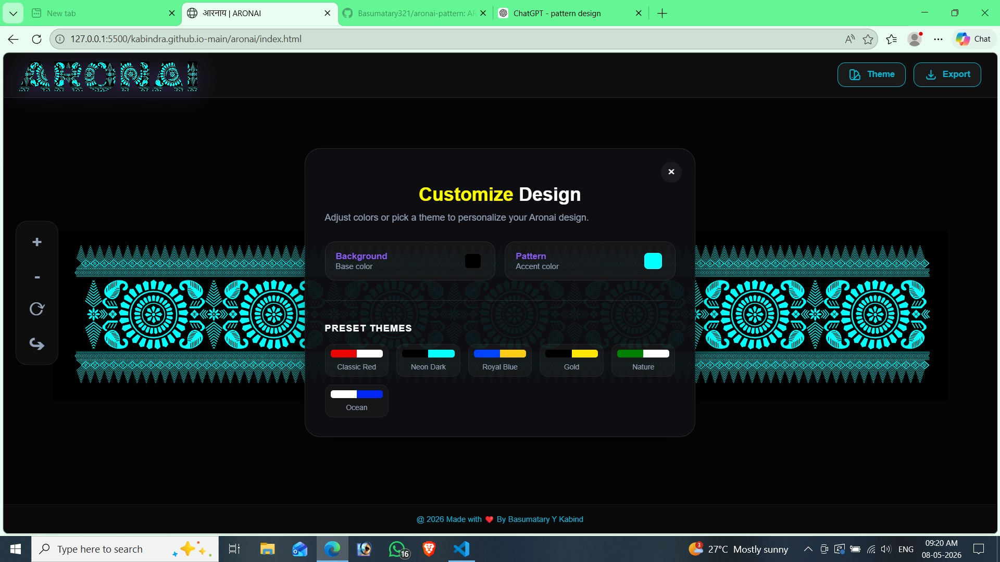
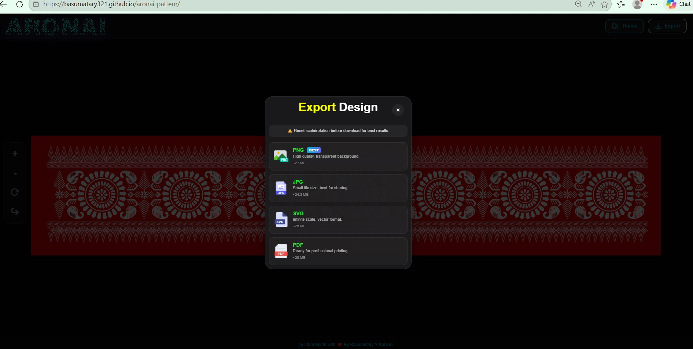

 <h1> # Aronai Pattern Maker 🎨</h1>

A modern, interactive web application designed to create and customize traditional Aronai patterns. Built with a focus on speed and user experience, this tool allows designers and enthusiasts to digitize traditional motifs with ease.

<a href="https://basumatary321.github.io/aronai-pattern/" target="_blank">
Live Demo</a>

<h3>### ✨ Features</h3>
<ul>
<li>Customization: Change background and pattern colors in real-time.</li>
<li>Navigation: Advanced Zoom (In/Out) and Rotation controls for precise viewing.</li>

<li>Mobile-First Design: Fully responsive UI with smooth pinch-to-zoom support.</li>
<li>High-Quality Exports: Download your designs in multiple professional formats.</li>
<li>Interactive UI: Smooth animated download progress popups and fast SVG rendering.</li>
</ul>
<h3>### 📸 Preview</h3>

<h3>### 📥 Supported Export Formats</h3>
<table border="1" cellspacing="0" cellpadding="10">
<tr>
<td>Format</td><td>Discription</td>
</tr>
<tr>
<td>PNG</td><td>High-resolution image with transparency support.</td>
</tr>
<tr>
<td>JPG</td><td>Compressed format ideal for standard printing.</td>
</tr>
<tr>
<td>PDF</td><td>Vector-based document for high-quality professional printing.</td>
</tr>
<tr>
<td>SVG</td><td>Scalable vector format for further editing in Illustrator or Inkscape.</td>
</tr>
</table>

<h3>### 🛠️ Technologies Used</h3>
<ul>
<li>Frontend: HTML5, CSS3, JavaScript (ES6+)</li>
<li>Graphics: SVG (Scalable Vector Graphics)</li>
<li>Libraries: jsPDF for PDF generation</li>
</ul>

<h3>### 📂 Project Structure</h3>
<pre>aronai-pattern-maker/
│
├── index.html       # Main application entry point
├── style.css        # Modern UI styling and layout
├── script.js        # Core logic for pattern manipulation
├── progress.js      # Download progress animation logic
├── download.html    # Dedicated export processing page
└── assets/          # Images, icons, and preview files
</pre>

<h3>### 🚀 Getting Started</h3>
<ol>
<li>Clone the Repository
<pre>bash
git clone https://github.com/Basumatary321/aronai-pattern.git
</pre>
</li>
<li>Run Locally
Simply open the index.html file in any modern web browser. No local server or installation is required.</li>
</ol>

<h3>### 🎯 Future Roadmap</h3>
<ul>
<li>[ ] Pattern Library: Add multiple traditional pattern presets.</li>
<li>[ ] AI Suggestions: Implement AI-driven color palette recommendations.</li>
<li>[ ] Cloud Save: User login system to save and manage custom designs.</li>
<li>[ ] Marketplace: A platform for users to share their unique patterns.</li>
</ul>

<h3>### 👨‍💻 Author</h3>

Kabindra Basumatary 
GitHub: @Basumatary321 
Institute: Techno IT Computer Institute

<h3>### 📄 License</h3>

This project is licensed under the MIT License. You are free to use, modify, and distribute it for personal or commercial projects.

Note: If you find this project helpful, please consider giving it a ⭐ to show your support!

